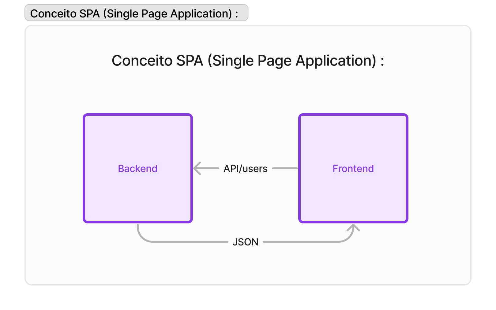

# Next JS

O Next.js, uma estrutura de desenvolvimento web para React, pode ser considerado uma evolução em relação aos tradicionais Single Page Applications (SPAs) em vários aspectos, e pode ajudar a abordar alguns dos problemas associados aos SPAs.

No modelo SPA tradicional, ao carregar a página, apenas o esqueleto da aplicação é enviado inicialmente ao cliente. Em seguida, ocorrem solicitações assíncronas ( assíncrono significa que as coisas podem acontecer independentemente do fluxo principal do programa.) para o backend para recuperar os dados necessários, e o frontend é atualizado dinamicamente, fazendo um map por exemplo. Isso pode resultar em uma experiência de usuário mais lenta, especialmente em conexões de internet mais lentas.

<figure><figcaption>
Conceito SPA (Single Page Application) :
</figcaption></figure>

Next.js, por outro lado, introduz o conceito de renderização no lado do servidor (Server-Side Rendering - SSR) e renderização estática (Static Site Generation - SSG), que podem ser usados ​​conforme necessário.

***

## <mark style="color:blue;">Server-Side Rendering (SSR)</mark>

O Next.js permite renderizar as páginas no lado do servidor. Isso significa que, ao solicitar uma página, o servidor gera o HTML correspondente, incluindo os dados necessários, antes de enviar a resposta ao navegador, pois o next cria um servidor em node.js, que é usado para interpretar js no lado do servidor e o Ract nada mais é do que código JS, então no Frontend já é devolvido o HTML pronto para ser mostrado. Isso pode melhorar significativamente o tempo de carregamento inicial e fornecer um conteúdo mais rápido e interativo para os usuários.

<figure><figcaption>
Server - Side Rendering (SSR)
</figcaption></figure>

***

## <mark style="color:blue;">Static Site Generation (SSG)</mark>

O Next.js também suporta a geração estática de páginas, o que significa que as páginas são geradas durante o tempo de construção e os dados são pré-renderizados. Isso é especialmente útil para conteúdos que não mudam com frequência. As páginas estáticas podem ser servidas diretamente de um CDN, proporcionando uma experiência de carregamento mais rápida. Por exemplo, temos um site de notícias que atualiza as notícias a cada 10 minutos, então não temos nescessidade de atualizar o nosso servidor contantemente, pois com o uso de muitos usuários poderia acarretar problemas, então ele mantem a página renderizada em cache, e atualiza ela somente quando nescessário.

<figure><figcaption>
Static Site Generation (SSG)
</figcaption></figure>

<mark style="color:blue;">Para Saber mais, documentação :</mark>


Documentação Next

